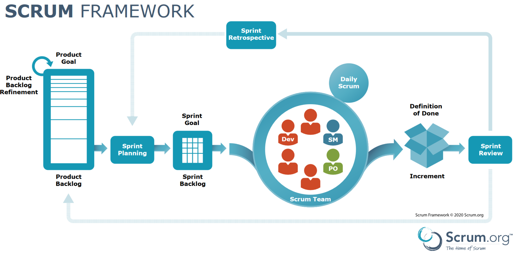

# Scrum - Le sprint et les events

## Le framework - schématisé

<figure><figcaption>
Poster officiel de <a href="https://scrumorg-website-prod.s3.amazonaws.com/drupal/2023-09/Scrum%20Framework%20with%20sdo%20logo%209.29.23.pdf">Scrum.org</a>
</figcaption></figure>

Vous retrouverez chacun des termes mentionnées sur ce schéma dans le guide officiel.


